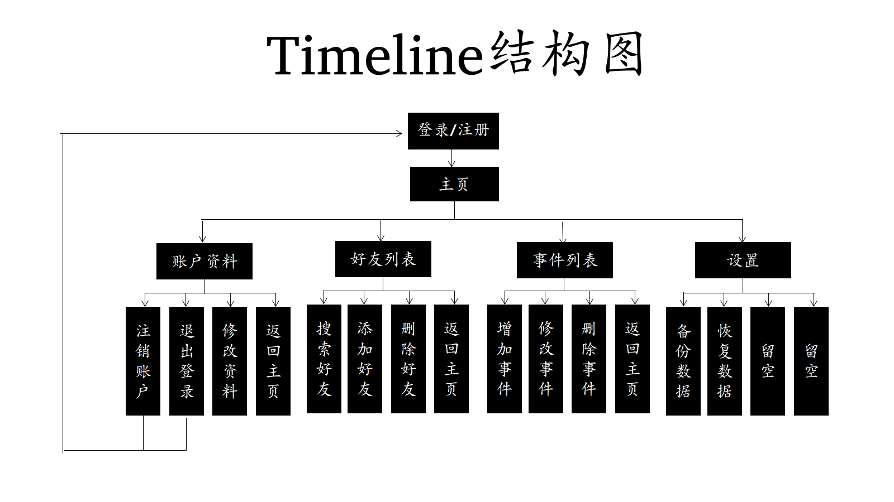

欢迎来到珍谊
=================
  
### 概述  
生活中我们认识了很多人后有时候别人的生日或最近要发生的事我们总是不经意忘记，再次面对时难免有些尴尬，于是想出了这个软件  

### 功能  
#### *v1.0*  
* 拥有一般记事本记事的功能  
* 可以记录一个人的详细信息。姓名，电话，生日，座右铭等  
* 查看某人时除了可以查看它的信息还可以看看最近它做过什么重要的事以及将要做什么重要的事  
* 也可以以时间线来显示你保存的所有人的最近将要做的事  
* 增加了事件错过通知  

#### *v1.1*  
* 增加感恩模块，记录每个人对自己提供的援助，生而为人必须学会感恩  
* 铃声通知  
* 开启联网功能后增加添加好友功能，好友之间可以互看时间线，了解对方将要做什么(当然，前提是对方打开了给别人看的权限)  
* 通过本地化设置优化一下输出内容和界面

### 依赖  
* compiler support c99
* mysql version 5+
